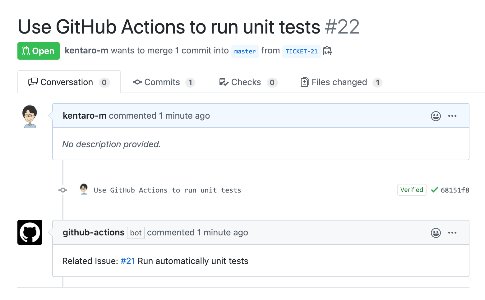

# Add an issue reference
A GitHub Action for adding a related issue reference to a pull request.

## :arrow_forward: Usage
A workflow adds a comment contained a link for a related issue based on the branch name to a pull request when a pull request is opened.



### Create a workflow

Add `.github/workflows/issue-reference.yml` with the following:

```yml
name: 'Issue Reference'
on: 
  pull_request:
    types: [opened]

jobs:
  issue-reference:
    runs-on: ubuntu-latest
    steps:
      - uses: kentaro-m/add-an-issue-reference-action@v2.0.0
        with:
          repo-token: "${{ secrets.GITHUB_TOKEN }}"
          branch-prefix: "TICKET-"
```

### Set up required parameters
Need to contain the required parameters on the workflow file.

- `repo-token` A token for the repository. Can be passed in using `{{ secrets.GITHUB_TOKEN }}`
- `branch-prefix` A prefix of the branch name for finding a related issue (e.g `TICKET-`).

### Add a comment contained a link for a related issue 
Create a branch based on the pattern of the branch name (`[branch prefix][issue number]`) set up on `.github/workflows/issue-reference.yml`.

For example, if `branch-prefix` is `TICKET-`, create a branch like `TICKET-8`.

When pushing your changes to the repository and creating a pull request, a workflow runs automatically.

## :memo: Licence
MIT