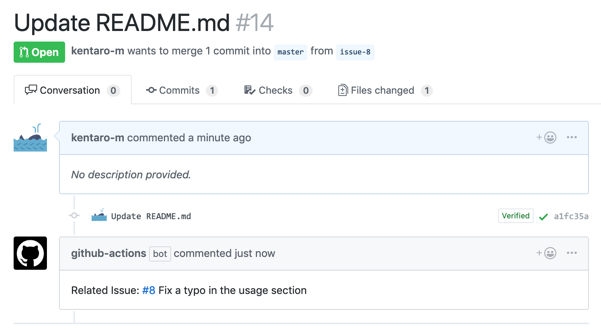

# add-an-issue-reference-action
A GitHub Action for adding a related issue reference to a pull request.

## :arrow_forward: Usage
A workflow adds a comment included a link for a related issue based on the branch name to a pull request when a pull request is opened.



Add `.github/main.workflow` with the following:

```hcl
workflow "Add an issue reference to a pull request" {
  on = "pull_request"
  resolves = "Add an issue reference"
}

action "Add an issue reference" {
  uses = "kentaro-m/add-an-issue-reference-action@master"
  secrets = ["GITHUB_TOKEN"]
  # branch name prefix
  args = "{\"branch\":\"issue\"}"
}
```

When you use this action, create a branch based on the pattern of the branch name (`[branch name prefix]-[issue number]`) set up on `main.workflow`. For example, if `args` is `"{\"branch\":\"issue\"}"`, create a branch like `issue-8`.
